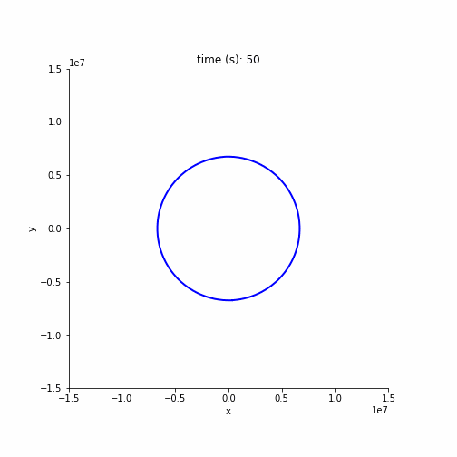

# Simulation of Orbital Ring

This is a simulation of an orbital ring--a system designed by Paul Birch to place payloads into orbit without rockets ([1](#1), [2](#2), [3](#3))

The idea is that a ring is placed in low earth orbit, and the momentum from that ring supports a stationary tether reaching down to the ground. Payload goes up the tether, and then accelerates along the ring to orbital velocity.

## Model
The orbital ring is modeled as a collection of point masses connected by springs, and the tethers are modeled as springs that pull down on the nearby point masses of the ring.

The mechanics of the system is calculated using the Hamiltonian. Rather than calculating all the forces explicitly, the code just computes the total energy, and then computes the gradient of the total energy with respect to the position and momentum vectors. Hamilton's equation shows how the energy gradient gives the change in position and momentum over time.

This model appears to be unstable (see the figure below). An initially small perturbation in the ring grows over time, until the ring crashes down to earth. I think this could be mitigated by two counter-rotating rings that are coupled together, but I haven't modeled this yet.

## Software

This model was made using:
- Python
- TensorFlow (parallel numeric calculations and automatic gradients)
- Numba (sequential numeric calculations)
- Pint (for keeping track of physical units)
- Holoviews/bokeh/matplotlib for plotting

## Running the simulation

To run the simulation, install the required packages (`pip install -r requirements.txt`), and open the `OrbitalRing.ipynb` notebook

## References
<a id="1">[1]</a>
[Birch, Paul. "Orbital Ring Systems and Jacob's Ladders-I." Journal of the British Interplanetary Society 35.11 (1982): 474-497.](http://www.orionsarm.com/fm_store/OrbitalRings-I.pdf)

<a id="2">[2]</a>
[Birch, Paul. "Orbital Ring Systems and Jacob's Ladders-II." Journal of the British Interplanetary Society (1983): 115-123.](http://www.orionsarm.com/fm_store/OrbitalRings-II.pdf)

<a id="3">[3]</a>
[Birch, Paul. "Orbital ring systems and Jacob's Ladders-III." British Interplanetary Society, Journal(Interstellar Studies) 36 (1983): 231-238.)](https://orionsarm.com/fm_store/OrbitalRings-III.pdf)